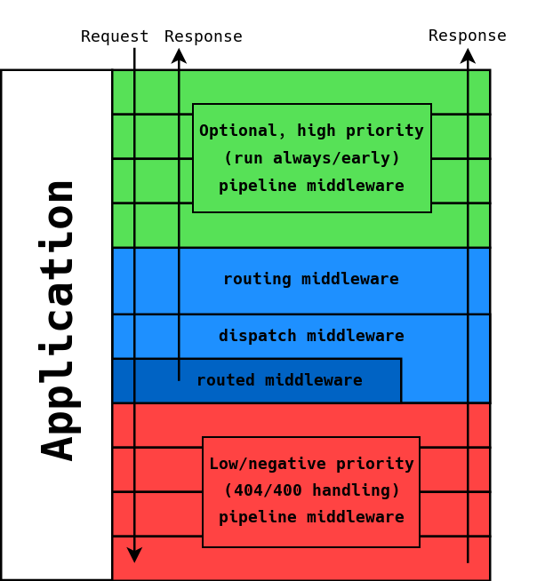

µSilex
======

[](https://packagist.org/packages/linkeddatacenter/usilex)
[](LICENSE)
[](https://scrutinizer-ci.com/g/linkeddatacenter/uSilex/?branch=master)
[](https://scrutinizer-ci.com/g/linkeddatacenter/uSilex/?branch=master)
[](https://scrutinizer-ci.com/g/linkeddatacenter/uSilex/build-status/master)


µSilex (aka micro silex) is a micro framework inspired by Pimple and PSR standards. All with less than 100 lines of code!

This project is a try to build a standard middleware framework for developing micro-services and
APIs endpoints that require maximum performances with a minimum of memory footprint.

Why [Pimple](https://pimple.symfony.com/)? Because it is lazy, consistent, fast, elegant and small (about 80 lines of code). What else? 

Why [PSR standards](https://www.php-fig.org/psr)? Because it is a successful community project with a lot of good introperable implementations (psr15-middlewares, zend stratigility, Guzzle, etc. etc.).

Why µSilex? Silex was a great framework now abandoned in favour of Symfony + Flex. This is good when you need more power and flexibility. But you have to pay a price in terms of complexity and memory footprint. 
µSilex it is a new project that covers a small subset of the original Silex project: a µSilex Application is just a Pimple Container implementing all [PSR-15 specifications](https://www.php-fig.org/psr/psr-15/). That's it. 

As a matter of fact, in the JAMStack, Docker and XaaS era, you can let lot of conventional framework features to other components in the system application architecture (i.e. caching, authentication, security, monitoring, etc. etc).

Is µSilex a replacement of Silex? No, but it could be used to build your own "Silex like" framework .

There are alternatives to µSilex? Yes of course. For example the [Zend  Expressive](https://docs.zendframework.com/zend-expressive/) component of the Zend Framework shares similar principles. But it is not "container centric" and is bound to zend libraries. Beside piping, Zend Expressive implements  routing as mechanism mechanisms for adding middleware to your application.

Have a nice day!


## Install

`compose require linkeddatacenter/usilex`

## Overview

Basically a µSilex provides the class **Application** that is a Pimple container that implements the PSR-15 middleware interface.

Middleware is now a very popular topic in the developer community, The idea behind it is “wrapping” your application logic with additional request processing logic, and then chaining as much of those wrappers as you like. So when your server receives a request, it would be first processed by your middlewares, and then after you generate a response it will also be processed by the same set (image from Zend Expressive).



Note that in this model, the traditional *routing->controller->view* is just a feature of an optional "router" middleware. In other words Model View Controller it is no more the only possible application architecture. This is good, because if you, for example, are developing a smart proxy microservice, the terms "model" and "view" do not apply. The only constraint is that least one middleware in the middleware chain is supposed to gererate a response (could be a response error, of course). 

A middleware is a piece of software that implements the PSR-15 middleware interface:

```php
use Psr\Http\Message\ResponseInterface;
use Psr\Http\Message\ServerRequestInterface;
use Psr\Http\Server\RequestHandlerInterface;
use Psr\Http\Server\MiddlewareInterface;

class \My\Middleware implements MiddlewareInterface {
    use \uSilex\Psr11Trait;
    
    public function process(
    	ServerRequestInterface $request, 
    	RequestHandlerInterface $handler
    	): ResponseInterface
    {
        //here your code that returns a response or passes the control to the handler
    }
}  
```

The best practices suggest to pass a context for dependency injection to the middleware through a PSR-11 container. For this reason µSilex provides a ready to use trait (\uSilex\Psr11Trait).

µSilex is not bound to any specific specific implementations (apart from Pimple) nor 
provides any middleware implementation.

Instead µSilex realizes a framework to use existing standard implementation. µSilex adopts PSR-7 specifications for http messages, PSR-15 for managing http handles and middleware and PSR-11 for containers.

## Usage

To bind µSilex with specific interface specifications, you need to configure some entries in the container:

- **uSilex.request**: a service that instantiate an implementation of PSR-7 server request object 
- **uSilex.responseEmitter**: an optional callable that echoes the http. If not provided, no output is generated. 
- **uSilex.exceptionHandler** a callable that generates an http response from a PHP Exception. If not provided just an http 500 header with a text body is ouput
- **uSilex.httpHandler**: a service that instantiate an implementation of PSR-15 http handler

µSilex Application exposes the PSR-15 middleware *process* method and the *run* method that realize typical server process workflow:
- creates a request using uSilex.request service
- calls the uSilex.httpHandler
- emits the http response calling uSilex.responseEmitter

If some php exceptions are thrown in the process, they are translated in Response by uSilex.exceptionHandler and then  emitted by uSilex.responseEmitter.

The signature for uSilex.responseEmitter is `function ($request, $container) { echo ....}` . 
The signature for uSilex.exceptionHandler is`function ($exception, $container) {}`.

There are tons of libraries that implement great reusable middleware that are fully compatible with µSilex. For example see [MW library](https://github.com/middlewares/psr15-middlewares)) and lot of great PSR-7 implementations that match µSilex requirements. µSilex is also compatible with lot of Silex Service Providers and with some Silex Application traits.

You can create your custom framework just selecting the the components that fit your needs. 
This fragment  uses the [Relay](http://relayphp.com/2.x) library for PSR-15 http handle provider and [Diactoros](https://docs.zendframework.com/zend-diactoros/) for PSR-7 http messages.

```php
require_once __DIR__.'/../vendor/autoload.php';
$app = new \uSilex\Application;
$app['uSilex.request'] = \Zend\Diactoros\ServerRequestFactory::fromGlobals();
$app['uSilex.responseEmitter'] = $app->protect( function($response) {echo $response->getBody();});
$app['uSilex.httpHandler'] = function($app) { 
    return new \Relay\Relay([new \My\Middleware($app)]); 
};
$app->run();
```

### the µSilex service providers

out-of-the-box µSilex give to you a set of Service Providers that you can use as example to implement yours.
See the code in  src/Provider directory.


#### Provider\Psr7\DiactorosServiceProvider

Bound a µSilex application to the [Zend Diactoros]() implementation for Psr7 specifications.

#### Provider\Psr15\RelayServiceProvider

Bound a µSilex application to [Relay](https://github.com/relayphp/Relay.Relay), a fast, no frill implementation of the PSR-15 specifications.

#### Provider\Psr15\ZendPipeServiceProvider

Bound a µSilex application to *MiddlewarePipe* part of the [zend-stratigility library](https://github.com/zendframework/zend-stratigility/) Psr15 implementation.

### Configuring new service providers

Services provider are normal Pimple service providers that optionally define the method "boot". This method will be called only once by the application method *boot*. Use this feature only when strictly necessary.

*Note that this is a bit different from old Silex approach, where boot was always called automatically before running the application.* 

A best practice to write a PSR-15 service provider is to allow user to declare middleware a service and to allow user to define the middleware queue (i.e. pipeline) in *handler.queue* application container The *handler.queue* element that must resolve in an array. For instance:

```php
...
$app= new Application;
$app->register( new MyFrameworkServiceProvider() };
$app['my.errorHandler'] = function($app) { return new \My\ErrorHandlerMiddleWare($app) };
$app['my.router'] = function($app) { return new \My\RouterMiddleWare($app) };
$app['my.notfound'] = function($app) { return new \My\NotFoundMiddleWare($app) };
$app['handler.queue'] = [
	'my.errorHandler'
	'my.router'
	'my.notfound'
];
$app->boot()->run();
```

## A complete example

```php
<?php
require_once __DIR__.'/../vendor/autoload.php';
use uSilex\Application;
use uSilex\Psr11Trait;
use uSilex\Provider\Psr15\RelayServiceProvider as Psr15Provider;
use uSilex\Provider\Psr7\DiactorosServiceProvider as Psr7Provider ;
use Psr\Http\Message\ResponseInterface;
use Psr\Http\Message\ServerRequestInterface;
use Psr\Http\Server\RequestHandlerInterface;
use Psr\Http\Server\MiddlewareInterface;
use Zend\Diactoros\Response\TextResponse;

class MyMiddleware implements MiddlewareInterface {
    use Psr11Trait;
    public function process(ServerRequestInterface $request, RequestHandlerInterface $handler): ResponseInterface {
        return new \Zend\Diactoros\Response\TextResponse( $this->get('message'));
    }
}  

$app = new Application;
$app->register(new Psr15Provider());
$app->register(new Psr7Provider());
$app['myMiddleware'] = function($app) { return new MyMiddleware($app) };
$app['message'] = 'hello world!';
$app['handler.queue'] = ['myMiddleware'];
$app->run();
```


See more examples in the html directory.


## Testing 

Using docker:

	$ docker run --rm -ti -v $PWD/.:/app composer bash
	$ composer install
	$ vendor/bin/phpunit
	$ exit
	$ docker run -d -p 8000:80 --name apache -v $PWD/.:/var/www/ php:apache

Point your browser to:

- http://localhost:8000/example1.php
- http://localhost:8000/example2.php
- http://localhost:8000/example3.php/hello/world

Destroy the container:

	$ docker rm -f apache

## Extending µSilex

Ask not why nobody is doing this. You are the "nobody"!


## Credits

µSilex is inspired to the following projects:

- https://github.com/php-fig/fig-standards/
- https://github.com/pimple/pimple and https://github.com/silexphp/Silex projects by Fabien Potencier
- https://github.com/relayphp/Relay.Relay project
